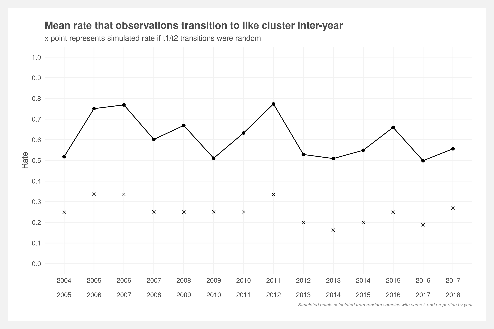
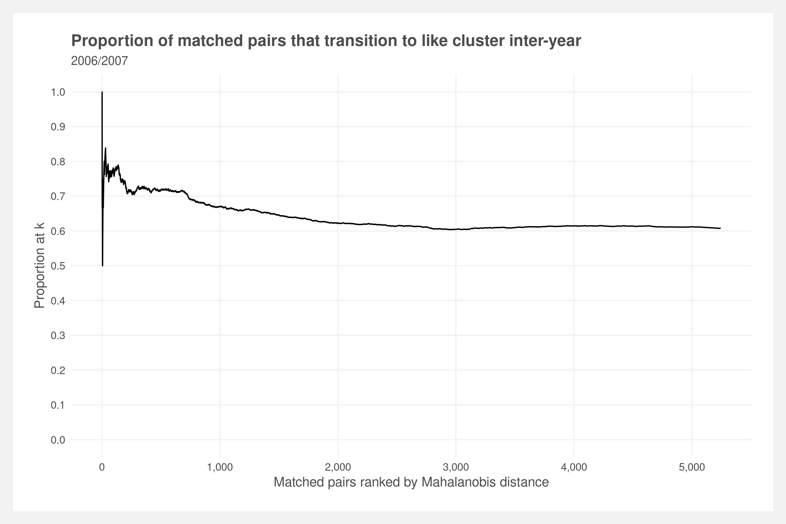
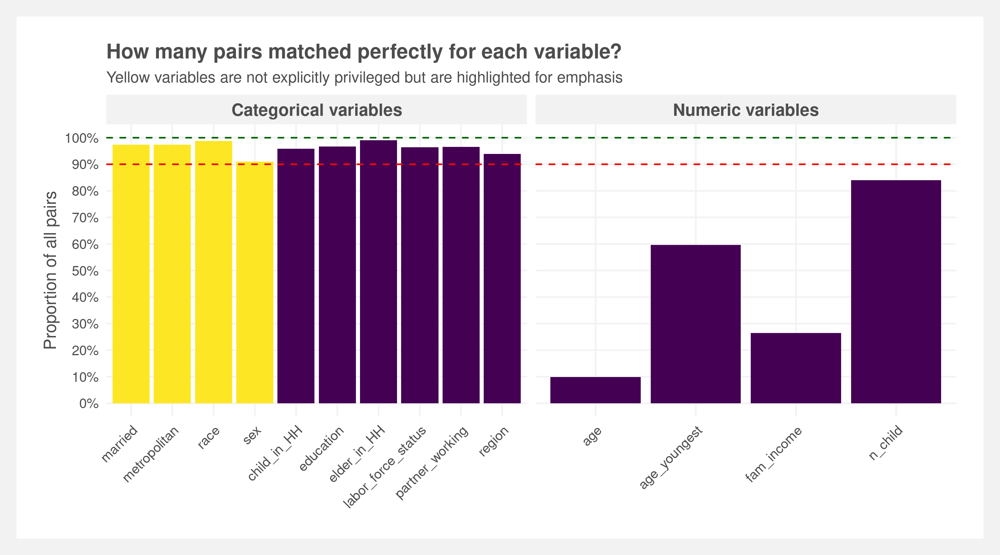

# Clustering and matching sequence data

### Folder structure
    .
    ├── analyses          # Clustering, matching, demographic vars, etc.
    │   ├── backtest      # 2003-2018 backtest scripts and results
    │   ├── data          # Output data from one run
    │   ├── matching      # Scripts to perform matching
    │   ├── plots         # Plots from one run
    │   └── supporting    # Supporting analyses
    ├── data              # Cleaned data and cleaning scripts
    ├── inputs            # Raw input data
    ├── outputs           # Formal write-ups
    ├── tests             # Unit tests
    └── README.md

### Status results

 

 

 

 

### Reproducibility
To reproduce, run the scripts in the following order:  
1. Download 2003-2018 multi-year microdata from the [BLS](https://www.bls.gov/tus/#data) and save to `inputs/ATUS-2003-2018/`    
2. Clean and consolidate the data:  
    1. `data/cleaning_atus30.R`  
    2. `data/cleaning_demographics.R`  
    3. `data/essential_industries.R`  
3.  Run a single year or full back test:  
    - Single year:  
        1. `analyses/matching/matching_mahalanobis.R`  
        2. `analyses/clustering.R`  
    - Back test:  
        1. `analyses/backtest/batch_backtest.R`  

 

See also: [ATUS repo](https://github.com/joemarlo/ATUS)
