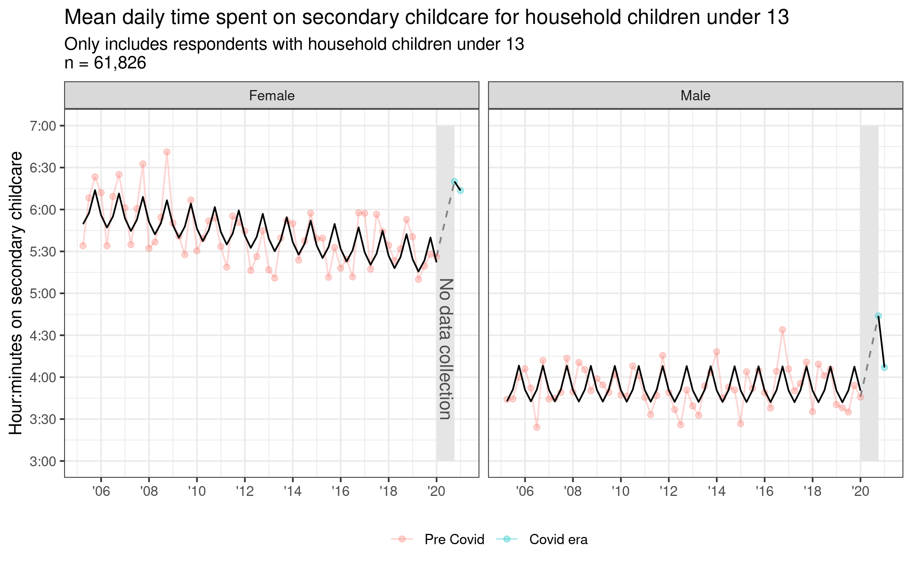

# Clustering and matching sequence data

Reproducible code for working paper on matching clustered sequence data and understanding secondary childcare via time use data.

 

### Folder structure
    .
    ├── analysis/		# Analysis scripts
    ├── data/		# Cleaned data
    ├── inputs/		# Raw input data
    ├── obsolete/		# Obsolete files
    ├── outputs/		# Formal write-ups and figures
    ├── R/			# Functions for cleaning and analysis
    ├── renv/       # Storage for renv
    ├── _targets/   # Storage for targets
    ├── tests/		# Unit tests
    ├── _targets.R    # [targets](https://books.ropensci.org/targets/) pipeline
    ├── run.R         # Run the targets pipeline from R
    ├── run.sh        # Run the targets pipeline from shell
    └── README.md

 

### Reproducibility

To reproduce, run the scripts in the following order:  
1. Download 2003-2020 multi-year microdata from the [BLS](https://www.bls.gov/tus/#data) and save to `inputs/ATUS-2003-2020/`    
2. Clean and consolidate the data:  ~~`meta_data.R`~~ `run.R`
3. Run the analyses  
    1. `analysis/timeseries.R`  
    2. `analysis/matching.R`  
    3. `analysis/sequence_analysis.R`  

 

See also: [ATUS repo](https://github.com/joemarlo/ATUS)
