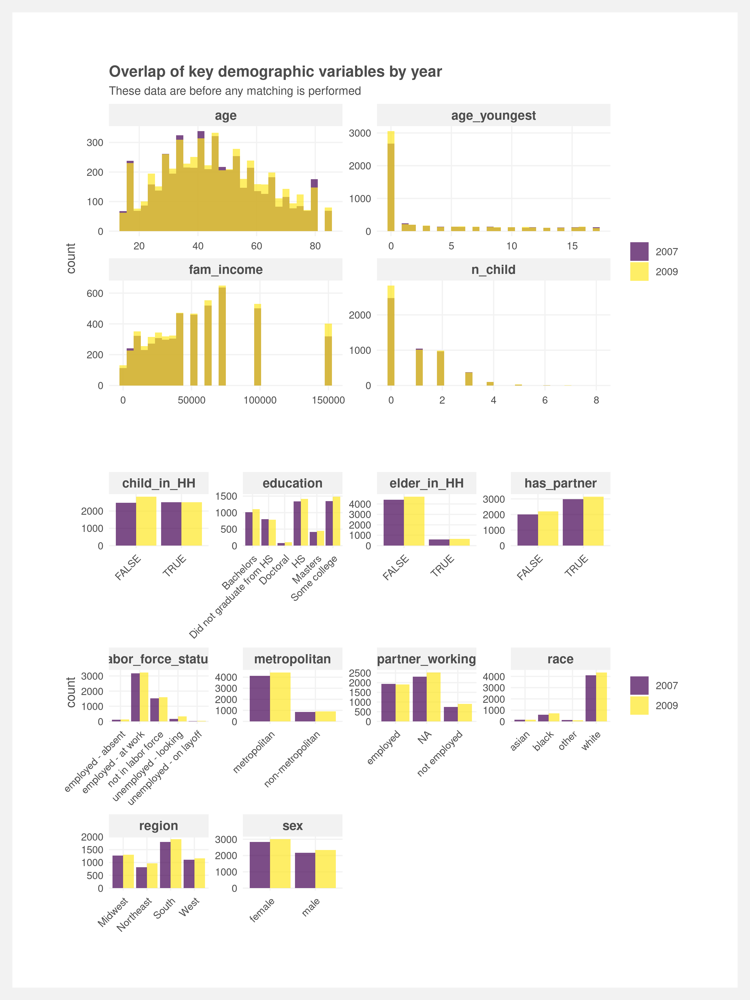
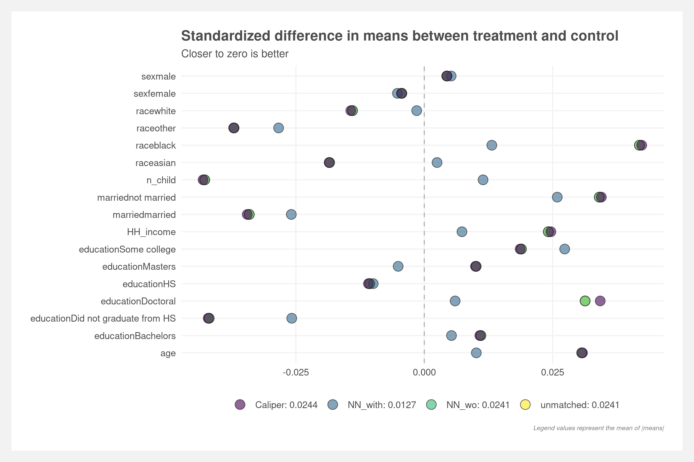

# Unsupervised learning and matching within sequence analysis

### Folder structure
    .
    ├── analyses          # Clustering, propensity matching, etc.
    │   └── plots         # Plots
    ├── data              # Cleaned data and cleaning scripts
    ├── inputs            # Raw input data
    ├── outputs           # Formal write-ups
    └── README.md

### Next steps
- Review demographics variable selection
- Review hard vs soft matching
- Find NAICS codes in CPS data

### Outstanding questions / notes
- Dates for two groups: 
    - Financial crisis occurred over many months. Does it make more sense to compare 2007 to 2009?
    - Look at dates that participants were surveyed
- Do we need full matching? Or just matching for all of 2007 or all of 2009
- Should we also try IPTW matching?
- How to do hard and soft matching? Just stratify and then propensity scores?
- Should we match on day of the week (currently all data is filtered to weekdays) and season?
- How do handle conditional fields in propensity score matching (e.g. `partner_working`)?

### Current matching results

 

 

 
 

See also: [ATUS repo](https://github.com/joemarlo/ATUS)
