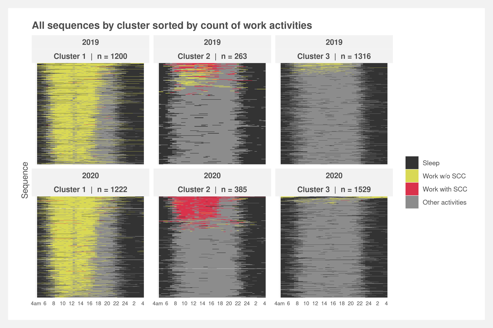

# Clustering and matching sequence data

Reproducible code for working paper on matching clustered sequence data and understanding secondary childcare via time use data.

 

### Folder structure
    .
    ├── analysis/		# Analysis scripts
    ├── data/		# Cleaned data
    ├── inputs/		# Raw input data
    ├── obsolete/		# Obsolete files
    ├── outputs/		# Formal write-ups and figures
    ├── R/			# Functions for cleaning and analysis
    ├── renv/         # Storage for renv
    ├── _targets/     # Storage for targets
    ├── tests/		# Unit tests
    ├── _targets.R      # targets pipeline
    ├── run.R           # Run the targets pipeline from R
    ├── run.sh          # Run the targets pipeline from shell
    └── README.md

 

### Reproducibility

To reproduce:  
1. Open `ATUS-matching.Rproj`. Install `renv` via `install.packages('renv')` and then run `renv::restore()`
2. Download, clean, and consolidate the data:  ~~`meta_data.R`~~ `run.R`. Note: this downloads the 2003-2020 multi-year microdata from the [BLS](https://www.bls.gov/tus/datafiles-0320.htm) and saves them `inputs/ATUS-2003-2020/`   
3. Run the analyses  
    1. `analysis/timeseries.R`  
    2. `analysis/matching.R`  
    3. `analysis/sequence_analysis.R`  

 

### TODO
- Recreate seqI plot with split by sex with whitespace gap
- Function'ize the sequence analysis script and run backtest
- Integrate cluster post hoc analysis

 

See also: [ATUS repo](https://github.com/joemarlo/ATUS)
