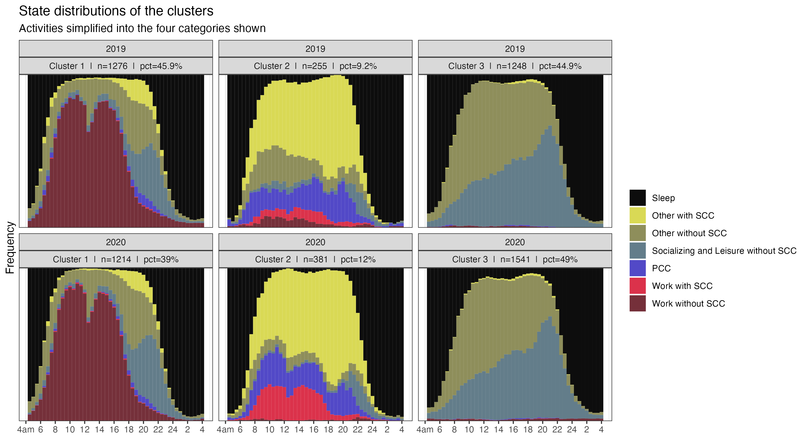
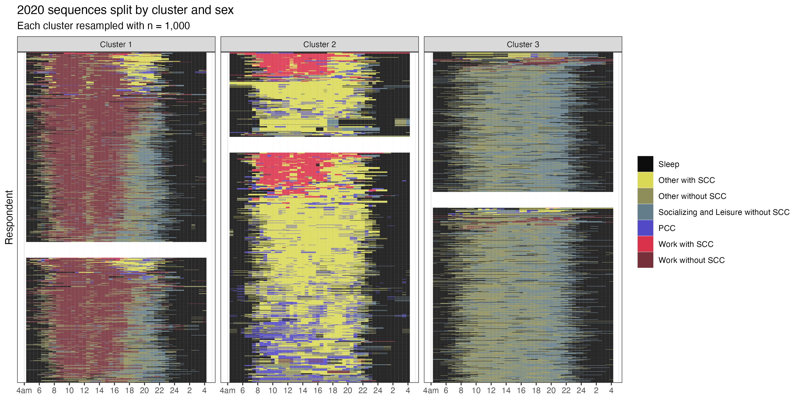

# Gender equity in the pandemic: Changes in time-use habits

Reproducible code for [paper](https://doi.org/10.1111/ijsw.12622) on understanding gender equity in the pandemic via examining time-use habits.

>We model the secular and quarterly trends to predict what would have occurred in the absence of the pandemic, contrasting this to what indeed happened. Our analyses consider aggregate and individual impacts, using methods of sequence analysis, clustering, and matching. Among our results, we find that the division of childcare responsibilities did not become more equitable during the pandemic.

 

 

### Folder structure
    .
    ├── analysis/		# Analysis scripts
    ├── data/		# Cleaned data
    ├── inputs/		# Raw input data
    ├── outputs/		# Formal write-ups and figures
    ├── R/			# Functions for cleaning and analysis
    ├── renv/         	# Storage for renv
    ├── _targets/     	# Storage for targets
    ├── tests/		# Unit tests
    ├── _targets.R      	# targets pipeline
    ├── run.R           	# Run the targets pipeline from R
    ├── run.sh          	# Run the targets pipeline from shell
    └── README.md

 

### Reproducibility

To reproduce:  
1. Open `ATUS-matching.Rproj`. Install `renv` via `install.packages('renv')` and then run `renv::restore()`
2. Download, clean, and consolidate the data:  `run.R`. Note: this downloads a few data files including the 2003-2021 multi-year microdata from the [BLS](https://www.bls.gov/tus/datafiles-0321.htm) (~2GB) and saves them `inputs/ATUS-2003-2021/`   
3. Run the analyses  
    1. `analysis/timeseries.R`  
    2. `analysis/matching.R`  
    3. `analysis/sequence_analysis.R`  

If you encounter an issue reproducing, please raise an issue on GitHub.

 

See also: [ATUS repo](https://github.com/joemarlo/ATUS)
